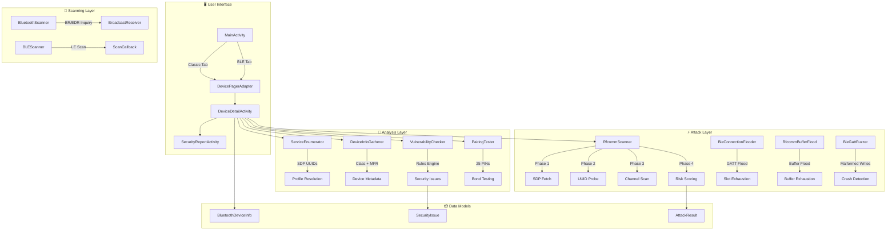
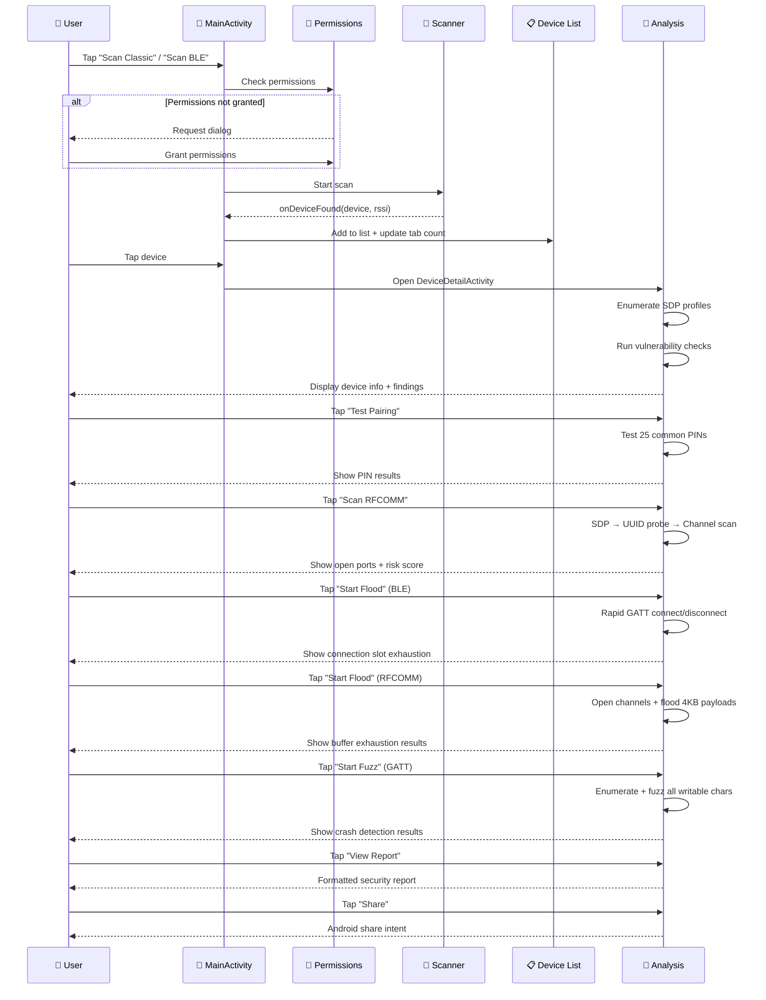

<div align="center">

```
██████╗ ██╗   ██╗██╗     ███████╗███████╗
██╔══██╗██║   ██║██║     ██╔════╝██╔════╝
██████╔╝██║   ██║██║     ███████╗█████╗  
██╔══██╗██║   ██║██║     ╚════██║██╔══╝  
██████╔╝╚██████╔╝███████╗███████║███████╗
╚═════╝  ╚═════╝ ╚══════╝╚══════╝╚══════╝
   SECURITY LAB  //  v1.0
```


<br/>

**Bluetooth Security Assessment Toolkit for Android**

`Scan` · `Enumerate` · `Exploit` · `Report`

<br/>

[**⬇ DOWNLOAD APK (7.4 MB)**](BTSecurityLab-v1.0-debug.apk) · [**📖 DOCS**](#-quick-start) · [**🔧 BUILD**](#-build-from-source)

</div>

---

## ⚡ Quick Start

<table>
<tr>
<td width="50%" valign="top">

### Install
```bash
# Option 1: Direct download
git clone https://github.com/MysticDevloper/BluetoothSecLab.git
# APK is at the repo root

# Option 2: Build from source
./gradlew assembleDebug
# Output: app/build/outputs/apk/debug/app-debug.apk
```

</td>
<td width="50%" valign="top">

### Requirements
```
┌─────────────────────────────────┐
│  ✓ Android 5.0+  (API 21)      │
│  ✓ Bluetooth hardware           │
│  ✓ Location services ON         │
│  ✓ Install from unknown sources │
└─────────────────────────────────┘
```

</td>
</tr>
</table>

---

## 🎯 What It Does

```
                    ┌──────────────────────────────────────────┐
                    │           BT SECURITY LAB                │
                    │         Assessment Pipeline              │
                    └──────────────┬───────────────────────────┘
                                   │
              ┌────────────────────┼────────────────────┐
              │                    │                    │
              ▼                    ▼                    ▼
     ┌────────────────┐  ┌────────────────┐  ┌────────────────┐
     │  🔍 DISCOVER   │  │  🔎 ANALYZE    │  │  ⚡ ATTACK     │
     │                │  │                │  │                │
     │ • Classic scan │  │ • SDP enum     │  │ • BLE flood    │
     │ • BLE scan     │  │ • Pairing test │  │ • RFCOMM flood │
     │ • RSSI signal  │  │ • RFCOMM probe │  │ • GATT fuzz    │
     │ • Device class │  │ • Vuln check   │  │ • Bond remove  │
     └────────────────┘  └────────────────┘  └────────────────┘
```

---

## 🧪 Capabilities

<details open>
<summary><b>📡 Device Discovery</b></summary>

<br/>

| Scan Type | Method | What It Finds |
|:---------:|:------:|:-------------|
| **Classic** | BR/EDR Inquiry | Paired & discoverable devices, RSSI, device class |
| **BLE** | Low Energy Scan | Advertising devices, advertisement data, signal strength |

```
Signal Strength Indicator:
  ▂▄▆█ █  -50 dBm  ████████████  Excellent
  ▂▄▆█    -65 dBm  ████████░░░░  Good
  ▂▄▆     -80 dBm  ██████░░░░░░  Fair
  ▂▄      -90 dBm  ████░░░░░░░░  Weak
  ▂      -100 dBm  ██░░░░░░░░░░  Very Weak
```

</details>

<details open>
<summary><b>🛡️ Vulnerability Analysis</b></summary>

<br/>

| Threat | Detection | CVE |
|:------:|:---------:|:---:|
| 🚨 OBEX File Transfer | Profile enumeration | CVE-2023-45866 |
| 🚨 Default PIN (HC-05/06) | Device name matching | — |
| ⚠️ Unbonded Services | Bond state + SDP check | CVE-2020-10135 |
| ⚠️ Legacy Profiles (HSP/HFP) | Profile enumeration | — |
| 🔵 BrakTooth (ESP32) | Device name matching | CVE-2021-28139 |

</details>

<details open>
<summary><b>🔌 RFCOMM Port Scanner</b></summary>

<br/>

```
Phase 1: SDP Discovery          Phase 2: UUID Probe
┌─────────────────────┐         ┌─────────────────────┐
│ fetchUuidsWithSdp() │────────▶│ createRfcommSocket  │
│ 32 known UUIDs      │         │ + protocol probe     │
└─────────────────────┘         └──────────┬──────────┘
                                           │
Phase 3: Channel Scan            Phase 4: Analysis
┌─────────────────────┐         ┌─────────────────────┐
│ Channels 1-30        │◀───────│ OBEX / AT / Text    │
│ 4 threads concurrent │         │ Risk scoring 0-10   │
└─────────────────────┘         └─────────────────────┘
```

**32 Known Bluetooth Profile UUIDs** including:
```
SPP · DUN · OBEX Push · OBEX FTP · HID · PAN · NAP
A2DP · AVRCP · HFP · HSP · BIP · SAP · PBAP · MAP
```

</details>

<details open>
<summary><b>🔐 Pairing Test</b></summary>

<br/>

```
Testing 25 Common Default PINs:
─────────────────────────────────
 ✓ 0000    ✗ 1234    ✗ 1111    ✗ 0001
 ✗ 9999    ✗ 12345   ✗ 00000   ✗ 11111
 ✗ 2222    ✗ 3333    ✗ 4444    ✗ 5555
 ✗ 6666    ✗ 7777    ✗ 8888    ✗ 1212
 ✗ 4321    ✗ 123456  ✗ 000000  ✗ 111111
 ✗ 888888  ✗ 123123  ✗ 654321  ✗ 1122
```

</details>

<details open>
<summary><b>💥 BLE Connection Flooder</b> <code>CVE-2026-52866</code></summary>

<br/>

> **Real attack** — exhausts target's BLE connection slots via rapid GATT connections.
> No root required. Auto-stops after 30 seconds.

```
Attack Flow:
┌──────────────┐    ┌──────────────────┐    ┌──────────────────┐
│ connectGatt  │───▶│ discoverServices │───▶│ Hold connection  │
│ (rapid fire) │    │ (keep active)    │    │ (8s per slot)    │
└──────────────┘    └──────────────────┘    └──────────────────┘

Target: Most BLE devices support 3-7 connections
Result: Legitimate devices blocked from connecting
CVE Pattern: CVE-2026-52866 (connection slot monopolization)
```

| Metric | Value |
|:------:|:-----:|
| Connections Attempted | 12 |
| Connection Interval | 500ms |
| Hold Duration | 8s per connection |
| Auto-stop | 30 seconds |
| Root Required | No |

</details>

<details open>
<summary><b>💣 RFCOMM Buffer Flood</b> <code>CVE-2026-31280</code></summary>

<br/>

> **Real attack** — opens multiple RFCOMM channels and floods with 4KB payloads
> to exhaust the target's RFCOMM buffer space. No root required.

```
Attack Flow:
┌──────────────┐    ┌──────────────────┐    ┌──────────────────┐
│ Open RFCOMM  │───▶│ Flood 4KB chunks │───▶│ Monitor errors   │
│ (up to 10)   │    │ (20 iterations)  │    │ (buffer exhaust) │
└──────────────┘    └──────────────────┘    └──────────────────┘

Target: Legacy Bluetooth stacks with limited RFCOMM buffers
Result: Device freeze or reboot (CVE-2026-31280 confirmed)
CVE Pattern: CVE-2026-31280 (Parani M10 RFCOMM DoS)
```

| Metric | Value |
|:------:|:-----:|
| Channels Opened | Up to 10 |
| Payload Size | 4096 bytes |
| Flood Iterations | 20 per channel |
| Total Data | ~800KB |
| Auto-stop | 25 seconds |
| Root Required | No |

</details>

<details open>
<summary><b>🔬 BLE GATT Fuzzer</b> <code>BSFuzzer Method</code></summary>

<br/>

> **Real attack** — enumerates all GATT services/characteristics, then fuzzes
> writable characteristics with malformed payloads (empty, oversized, null-byte,
> AT injection, HTTP injection). Based on BSFuzzer methodology (USENIX 2025).

```
Attack Flow:
┌──────────────┐    ┌──────────────────┐    ┌──────────────────┐
│ GATT Connect │───▶│ Enumerate all    │───▶│ Fuzz each char   │
│              │    │ services + chars │    │ (15 payloads)    │
└──────────────┘    └──────────────────┘    └──────────────────┘

Payload Types:
  Empty · Single byte · 20B MTU · 100B · 255B (max ATT)
  512B oversized · 1024B · All zeros · All 0xFF
  Null terminator · AT injection · HTTP injection
```

| Metric | Value |
|:------:|:-----:|
| Payload Types | 15 per characteristic |
| Max Write Attempts | 50 |
| Write Delay | 200ms |
| Crash Detection | Disconnect monitoring |
| Auto-stop | 30 seconds |
| Root Required | No |

</details>



---

## 📁 Project Structure

```
BluetoothSecLab/
│
├── 📄 README.md                    ← You are here
├── 📄 BTSecurityLab-v1.0-debug.apk ← Ready to install
├── 📄 build.gradle.kts             ← Root build config
├── 📄 settings.gradle.kts          ← Project settings
├── 📄 gradle.properties            ← Gradle properties
│
├── 📂 app/src/main/
│   ├── 📄 AndroidManifest.xml      ← Permissions & activities
│   │
│   ├── 📂 java/com/bluetoothseclab/
│   │   │
│   │   ├── 🖥️ UI Layer
│   │   │   ├── MainActivity.kt         # Scan controls + device tabs
│   │   │   ├── DeviceDetailActivity.kt # Device detail + tests
│   │   │   ├── SecurityReportActivity.kt # Report generation
│   │   │   ├── DevicePagerAdapter.kt   # Classic/BLE tab adapter
│   │   │   └── PermissionsHelper.kt    # Permission management
│   │   │
│   │   ├── 📡 Scanning Layer
│   │   │   ├── BluetoothScanner.kt     # Classic BR/EDR discovery
│   │   │   └── BLEScanner.kt           # Low Energy scanning
│   │   │
│   │   ├── 🔬 Analysis Layer
│   │   │   ├── ServiceEnumerator.kt    # SDP profile enumeration
│   │   │   ├── DeviceInfoGatherer.kt   # Device class + manufacturer
│   │   │   ├── VulnerabilityChecker.kt # Security rule engine
│   │   │   └── PairingTester.kt        # PIN testing + bond mgmt
│   │   │
│   │   ├── ⚡ Attack Layer
│   │   │   └── attacks/
│   │   │       ├── RfcommScanner.kt         # RFCOMM port scanner
│   │   │       ├── BleConnectionFlooder.kt   # BLE connection slot DoS
│   │   │       ├── RfcommBufferFlood.kt      # RFCOMM buffer flood DoS
│   │   │       └── BleGattFuzzer.kt           # GATT service fuzzer
│   │   │
│   │   └── 📦 Models
│   │       └── models/
│   │           ├── BluetoothDeviceInfo.kt
│   │           ├── SecurityIssue.kt
│   │           └── AttackResult.kt
│   │
│   └── 📂 res/
│       ├── layout/                 ← XML layouts
│       ├── drawable/               ← Icons & backgrounds
│       ├── values/                 ← Strings & themes
│       └── menu/                   ← Toolbar menu
```

---

## 🔄 Scan Flow



---

## 🔧 Build from Source

<table>
<tr>
<td width="60%">

### Prerequisites
```
┌──────────────────────────────────────────┐
│  IDE:    Android Studio Arctic Fox+      │
│  SDK:    Android SDK 34                  │
│  JDK:    OpenJDK 17                      │
│  Kotlin: 1.9.x                           │
└──────────────────────────────────────────┘
```

### Build Commands
```bash
# Clone
git clone https://github.com/MysticDevloper/BluetoothSecLab.git
cd BluetoothSecLab

# Debug build
./gradlew assembleDebug

# Release build (requires signing config)
./gradlew assembleRelease
```

### Output
```
app/build/outputs/apk/debug/app-debug.apk     (7.4 MB)
```

</td>
<td width="40%">

### Tech Stack
```
┌─────────────────────────────┐
│  🟢 Kotlin 1.9              │
│  🟡 Android SDK 34          │
│  🔵 Material Design 1.11    │
│  🟣 AndroidX Core 1.12      │
│  ⚪ ConstraintLayout 2.1    │
│  🔴 Navigation 2.7          │
│  🟠 CardView 1.0            │
│  🔵 RecyclerView 1.3        │
└─────────────────────────────┘
```

</td>
</tr>
</table>

---

## ⚠️ Known Limitations

```
┌─────────────────────────────────────────────────────────────┐
│  ⚠  RFCOMM reflection may not work on all Android versions │
│  ⚠  PIN testing blocked on Android 12+ for unbonded devs   │
│  ⚠  BLE GATT write deprecated on API 33+ (still functional)│
│  ⚠  True BLE deauth frames need external HW (ESP32/Ubert)  │
│  ⚠  Risk scoring is heuristic, not formal vuln scanner      │
│  ⚠  All attacks auto-stop after 25-30s for lab safety       │
└─────────────────────────────────────────────────────────────┘
```

---

## 📋 Permissions Matrix

| Permission | Why | Android 6+ | Android 12+ |
|:----------:|:---:|:----------:|:-----------:|
| `BLUETOOTH` | Classic BT | Auto | Auto |
| `BLUETOOTH_ADMIN` | Adapter control | Auto | Auto |
| `BLUETOOTH_SCAN` | BLE scanning | — | Runtime |
| `BLUETOOTH_CONNECT` | Device connection | — | Runtime |
| `ACCESS_FINE_LOCATION` | BT discovery | Runtime | Runtime |
| `ACCESS_COARSE_LOCATION` | Fallback | Runtime | Runtime |

---

## 📊 Severity Legend

```
┌────────┬────────────────────────────────────────────────┐
│  🚨    │  CRITICAL — Immediate risk, disable immediately │
│  ⚠️    │  HIGH — Significant exposure, restrict access   │
│  🔵    │  MEDIUM — Review required, ensure bonding       │
│  🟢    │  LOW — Informational, minimal risk              │
│  ℹ️    │  INFO — Observation, no direct risk             │
└────────┴────────────────────────────────────────────────┘
```

---

<div align="center">

### ⚖️ Legal Disclaimer

> This tool is for **authorized security testing only**.
> Use only on devices you own or have explicit written permission to test.
> Unauthorized use may violate laws including CFAA (US), GDPR (EU), and local regulations.
> The developer assumes no liability for misuse.

---

**BT Security Lab** · Built with 🔒 for security researchers

</div>
